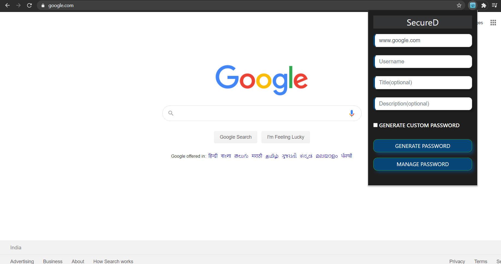
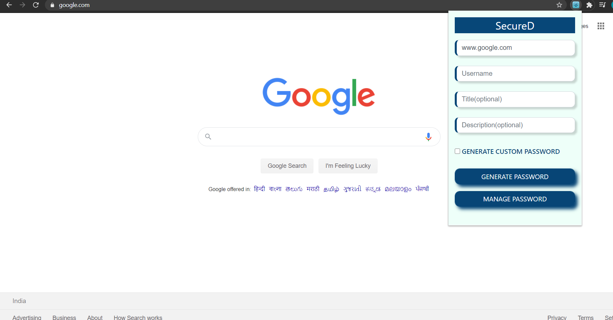
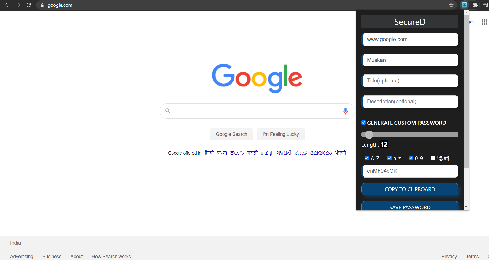
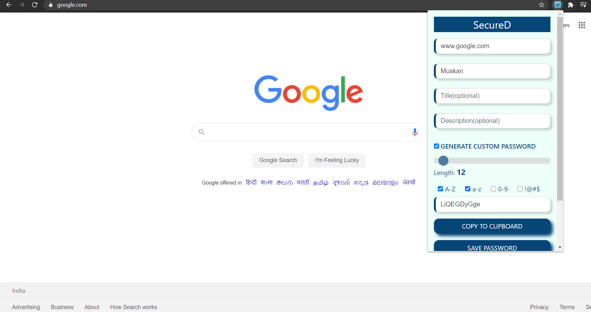
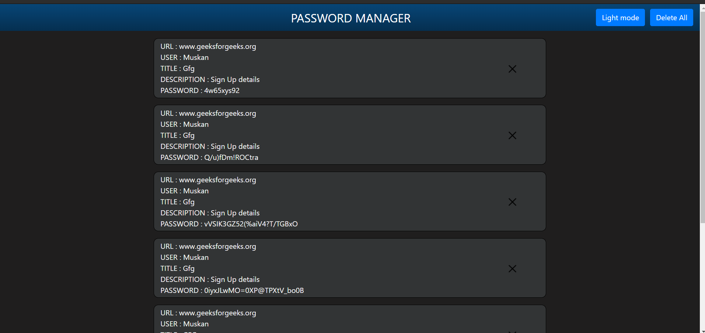
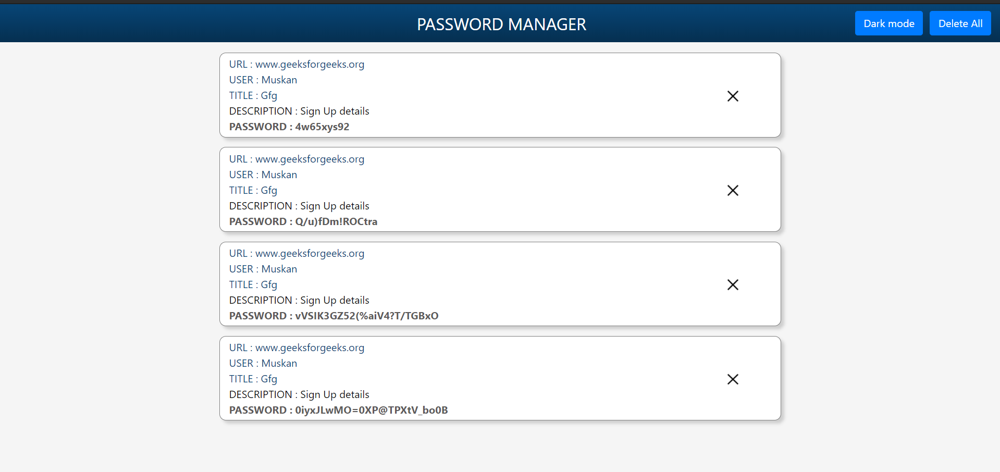
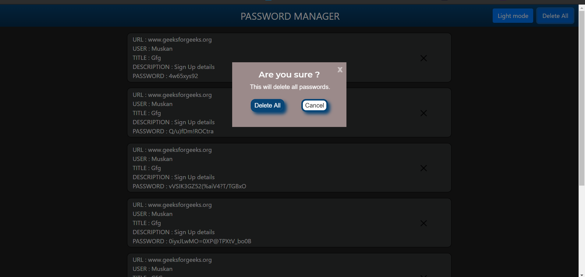
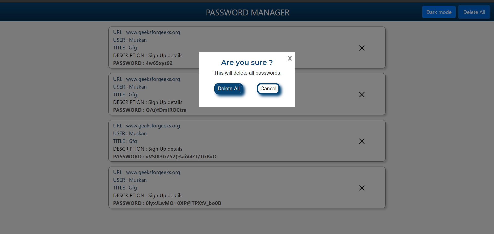

# SecureD - Chrome Extension 
# A Password Generator/Vault

# Project Description
1. It is an open-source Chrome Extension that allows people to generate and copy safe and secure passwords using an algorithm implemented in JavaScript.
2. A Chrome Extension implementing chrome API's.
3. Proper Chrome Extension coding standards are maintained like background and content scripts.
4. Users have to do less as the extension is smart enough to auto-detect the user's username and URL and autofill them in the popup accordingly.
5. User don't have to manually copy the generated password in the required field as the extension does it for him as soon as he saves password.
6. The user can generate a password by customizing the length, characters, etc or choose to generate a password by default method with a very user-friendly UI.
7. He/She can choose to delete saved passwords as and when required.
8. The user can choose to view the extension in light or dark mode as per convenience.

# Who did we design this Extension for?
Everyone as all of us needs to store password and use them in future. UI is designed in such a way that even a small child can use it efficiently without any confusion. UX is designed for the users on go so that they can use it efficiently.
# Inspiration for this Project
We decided to take part in a Hackathon by HackGujrat, a 30 hour long hackathon where we have to make something for the comminuity. The four of us did a lot of brainstorming and then came up with the idea of a "Password Generator" chrome extension. We came up with quite a few challenges and learnt a lot solving them. 

# Project Structure
```bash
Build
    ├── 128.png
    ├── 16.png
    ├── 48.png
    ├── 64.png
    ├── background.js
    ├── Checkout.txt
    ├── content.js
    ├── jquery-3.5.1.min.js
    ├── managePass
    │   ├── darkmode.css
    │   ├── delete-bin.png
    │   ├── delete.png
    │   ├── index.html
    │   ├── manage.js
    │   ├── style.css
    │   └── three-dots.png
    ├── manifest.json
    ├── passwordGenerator
    │   └── passwordGenerator.js
    └── popup
        ├── dark_mode.css
        ├── icon.png
        ├── index.html
        ├── popup.js
        └── style.css


```

# Screenshots

#### Popup screen to generate and save default passwords
 

<br>

#### Popup screen to generate and save custom passwords
 

<br>

#### Manage password screen to view saved passwords
 

<br> 

#### Delete all password dialog to confirm delete all saved passwords
 

<br> 

# Contributions
Contributions are welcome.
1. Submit an [issue](https://github.com/nakshatra-bazukaa/SecureD-Chrome-Extension/issues) describing your proposed fix or feature.
2. If your proposed fix or feature is accepted then, fork, implement your code change.
3. Ensure your code change follows the **standard code style and structure**.
4. Ensure your code is properly tested.
5. Ensure your commits follow the **standard commit message style**
6. Submit a pull request.
